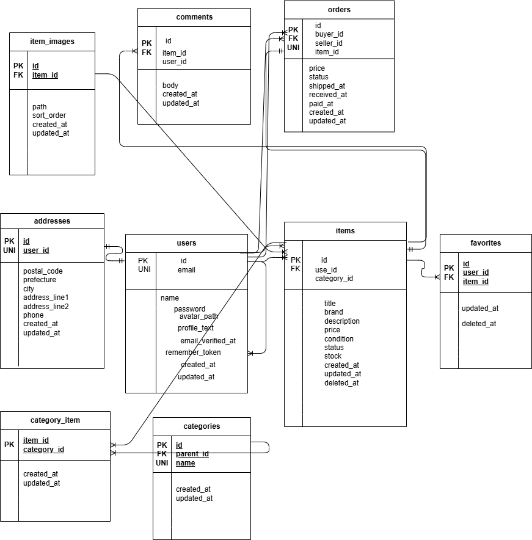

# アプリケーション名

coachtech-fleamarket

## 環境構築

# リポジトリのクローン

git clone
git@github.com:miyu020804/coachtech-fleamarket.git
cd coachtech-fleamarket

# Docker 起動

sudo docker compose build
sudo docker compose up -d

# Laravel 初期設定

sudo docker compose exec php composer install
sudo docker compose exec php php artisan key:generate
sudo docker compose exec php php artisan migrate --seed

# 使用技術

PHP 8.1.33
Laravel 8.83.27
MySQL 8.0.26
nginx 1.21.1
Docker / docker-compose
VSCode (WSL2 / Ubuntu)

# ER 図

# URL

アプリ本体(トップページ): http://localhost/
phpMyAdmin: http://localhost:8080
ログインページ: http://localhost/login
ログイン用メールアドレス:test9@example.com
ログイン用パスワード:password123
